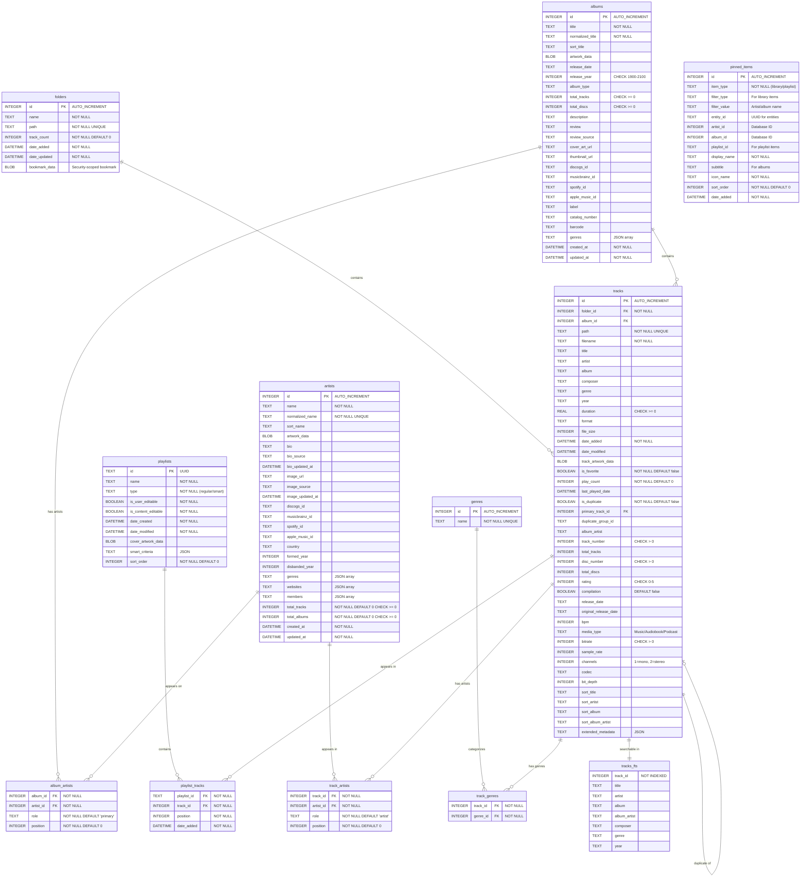

<div>
<h3>Petrichor</h3>
<p>An offline music player for macOS</p>
<a href="https://github.com/kushalpandya/Petrichor/releases/latest"></a>
</div>

<br/><br/>

<div align="center">
<a href="https://github.com/kushalpandya/Petrichor/releases"></a>
<a href="https://github.com/kushalpandya/Petrichor/actions/workflows/ci.yml"></a>
<a href="https://github.com/kushalpandya/Petrichor/blob/main/LICENSE"></a>
<a href="https://github.com/kushalpandya/Petrichor/"></a>
<br/>
<br/>
<a href="https://github.com/kushalpandya/Petrichor/releases/latest"></a>

<br/>
<br/>

<br/>

</div>

---

## Summary

### ✨ Features

- Everything you'd expect from an offline music player!
- Supports wide variety of audio file formats;
  - MP3, AAC/M4A, WAV, AIFF, AIF, ALAC
  - Ogg Vorbis, Speex, Opus, and FLAC
  - APE (Monkey's Audio)
  - MPC (Musepack)
  - TTA (True Audio)
  - WV (WavPack)
  - DSF/DFF (Direct Stream Digital)
  - ... MOD, IT, S3M, XM, and AU
- Map your music folders and browse your library in an organized view.
- Show lyrics of a playing track when available, including ability to download missing lyrics.
- Create, import or export playlists.
- Manage the play queue interactively using drag and drop
- Browse music using folder view when needed.
- Pin _anything_ (almost!) to the sidebar for quick access to your favorite music.
- Navigate easily: right-click a track to go to its album, artist, year, etc.
- Native macOS integration with menubar and dock playback controls, plus dark mode support.
- Works well with large libraries containing thousands of songs.
- Last.fm scrobbling support

💡 **Tip**: Petrichor relies heavily on tracks having good metadata for all its features to work well.

### ⌛ Upcoming Features

- ~~Automatic in-app updates~~ (✅ [v1.0.0](https://github.com/kushalpandya/Petrichor/releases/tag/v1.0.0) )
- ~~Better file format support (eg; Opus & OGG)~~ (✅ [v.1.2.0](https://github.com/kushalpandya/Petrichor/releases/tag/v1.2.0))
- ~~Audio Equalizer~~ (✅ [v.1.2.0](https://github.com/kushalpandya/Petrichor/releases/tag/v1.2.0))
- AirPlay 2 casting support
- Miniplayer and full-screen modes
- Smart playlists with user-configurable conditional filters
- Online album & artist information fetching
- ... and much more!

###  Requirements

- macOS 14 or later

### ⚙️ Installation

#### Manually

- Go to [Releases](https://github.com/kushalpandya/Petrichor/releases) and download the latest `.dmg`.
- Open the it and drag the app icon into the Applications folder.
- In Applications, right-click **Petrichor > Open**.

#### Homebrew

```
brew install --cask petrichor
```

### 🚀 Get Started

[Petrichor User Guide](https://github.com/kushalpandya/Petrichor/wiki)

### 📷 Screenshots

**Note:** These may not be up-to-date.

<div align="center">


</div>

### 🔒 Privacy & Data Access

- Petrichor is sandboxed and notarized by Apple.
- It has two permissions on macOS as follows;
  - **Read-write access**
    - To read and write into user-selected files and folders,
      write access is only used for exporting M3U playlist files.
  - **Network access**
    - To check for and install app updates.
    - Download track lyrics from the internet (disabled by default)
    - Last.fm scrobbling (disabled by default)
        - When enabled, app may ask to store your Last.fm session information in macOS Keychain, if you choose to allow it, macOS will ask for your user account password to store the information in Keychain.
        - App **does not** store your Last.fm username or password, you still have to provide it on Last.fm website that opens in browser during configuration, once done, app only receives a session key to scrobble track playbacks with your account.
- It doesn't (and never will) have any analytics on how you use the app.
- It never changes your audio files or folder structure in any way.
- Your library data remains offline always.

## 🏗️ Development

### Motivation

I have a large collection of music files that I’ve gathered over the years, and I missed having a good offline
music player on macOS. I've used several free and paid options but I missed the simplicity and features commonly
found in streaming apps; so I built Petrichor to scratch that itch and learn Swift and macOS app development
along the way!

### Implementation Overview

- Built with Swift and SwiftUI with some parts in AppKit for the best macOS integration.
- Once folders containing music files are added, the app scans them, extracts required metadata, and populates the SQLite database.
- The app does **not** alter your music files, it only reads from the directories you add.
- Tracks searching is handled by [SQLite FTS5](https://www.sqlite.org/fts5.html).
- Playback is handled by [AVFoundation](https://developer.apple.com/av-foundation/) and third-party audio decoders.

<details>
<summary>View Database Schema</summary>



</details>

### Credits

Petrichor wouldn't be possible without following open source projects!

- [SFBAudioEngine](https://github.com/sbooth/SFBAudioEngine)
- [GRDB.swift](https://github.com/groue/GRDB.swift/)
- [Sparkle](https://github.com/sparkle-project/Sparkle)

### Development Setup

- Make sure you’re running macOS 14 or later.
- Install [Xcode](https://developer.apple.com/xcode/).
- Clone the repository and open `Petrichor.xcodeproj`

#### Build & Release

You can build your own `.dmg` installer using the [`build-installer.sh`](Scripts/build-installer.sh) script,
although it requires you to have a paid Apple Developer account to notarize the compiled binary and installer,
you can use `--bypass-notary` option if you don't want to notarize. To use the script, make sure you have
following tools installed along with Xcode;

- [xcpretty](https://github.com/xcpretty/xcpretty)
- [create-dmg](https://github.com/sindresorhus/create-dmg)

## 💖 Sponsors

Thank you to all the sponsors for supporting Petrichor's development!

<!-- sponsors --><a href="https://github.com/furilo"></a><a href="https://github.com/laurens94"></a><a href="https://github.com/juliangruber"></a><a href="https://github.com/t3sec"></a><a href="https://github.com/nchudleigh"></a><a href="https://github.com/"></a><a href="https://github.com/"></a><!-- sponsors -->

## 📝 License

- Petrichor is licensed under [MIT](LICENSE)
- Core dependencies (SFBAudioEngine, GRDB, Sparkle) are licensed under MIT
- Audio codec libraries (FLAC, Vorbis, Opus, etc.) are dynamically linked and use various open source licenses including GPL and LGPL

For complete third-party license information, see [ACKNOWLEDGEMENTS.md](ACKNOWLEDGEMENTS.md)
